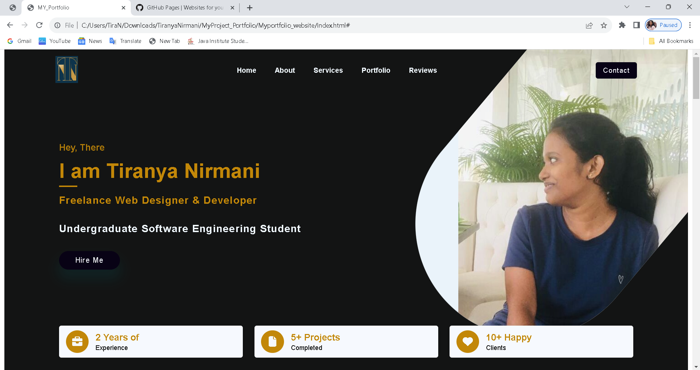
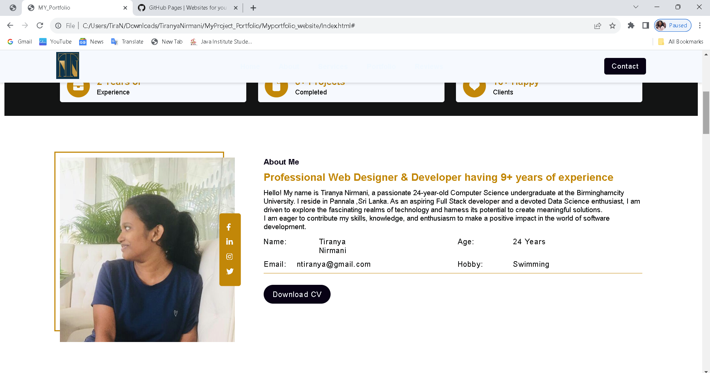
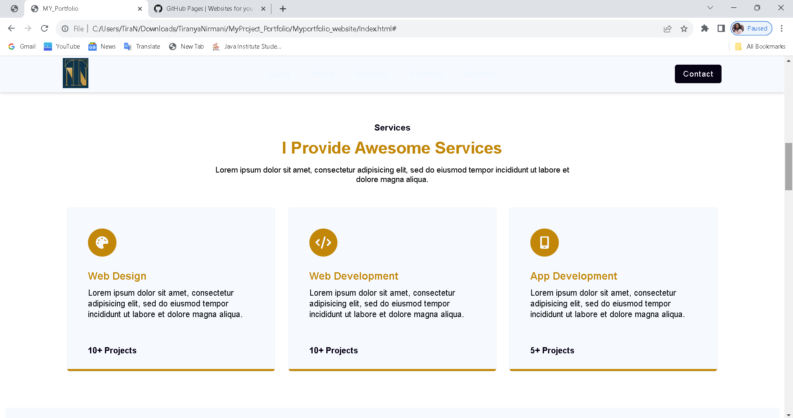
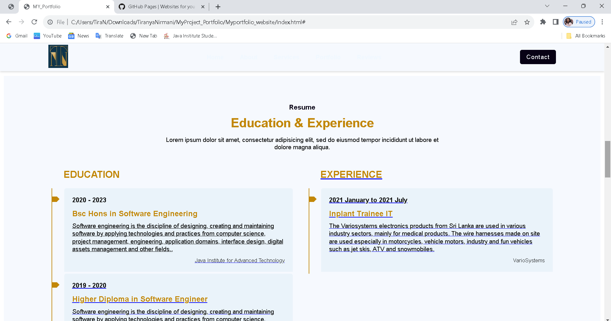
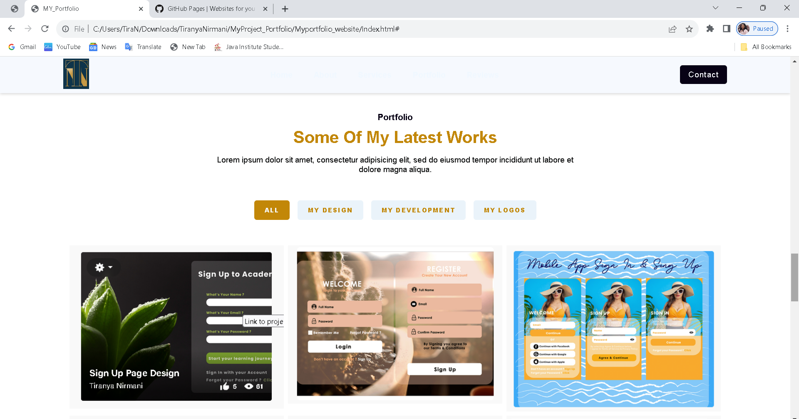
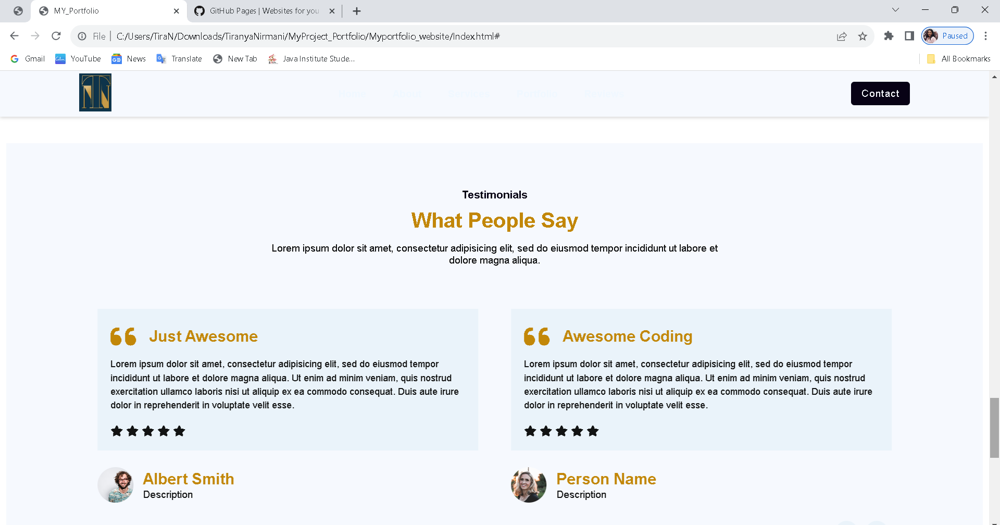
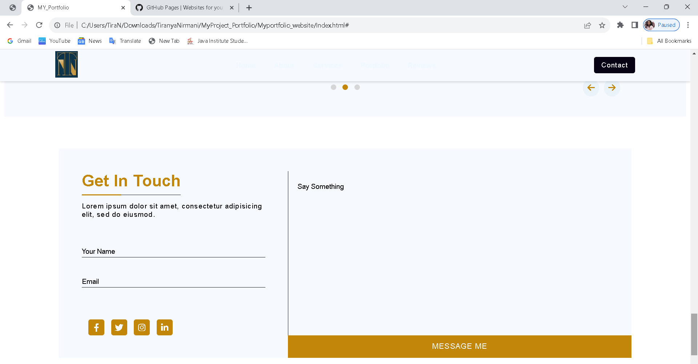

# Myportfolio_website

<!-- Improved compatibility of back to top link: See: https://github.com/pull/73 -->

<!--
*** Thanks for checking out the Best-README-Template. If you have a suggestion
*** that would make this better, please fork the repo and create a pull request
*** or simply open an issue with the tag "enhancement".
*** Don't forget to give the project a star!
*** Thanks again! Now go create something AMAZING! :D
-->

<h1>Screenshot of My Portfolio</h1>

 

 

 

 

 

 

